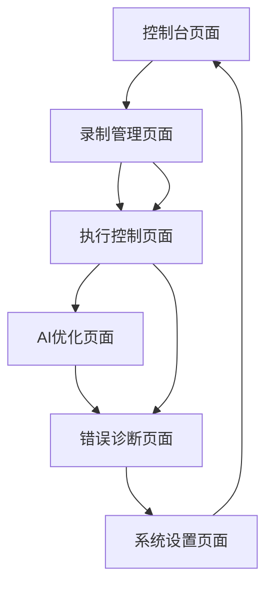

# PuppetMaster - 智能自动化交互框架产品需求文档

## 1. 产品概述

PuppetMaster是一个专为加密钱包操作设计的智能自动化交互框架，能够录制用户操作并通过AI辅助实现批量自动化执行。
- 解决加密钱包操作重复性高、效率低下的问题，为DeFi用户和开发者提供智能化的批量操作解决方案。
- 通过AI优化和随机化技术，模拟真实用户行为，提高操作成功率和安全性。
- 目标成为Web3领域领先的自动化工具，服务于专业交易者、DeFi协议开发者和批量操作需求用户。

## 2. 核心功能

### 2.1 用户角色

| 角色 | 注册方式 | 核心权限 |
|------|----------|----------|
| 普通用户 | 直接访问系统 | 可使用基础录制和执行功能，单实例操作 |
| 高级用户 | API密钥配置 | 可使用AI优化功能，多实例并行执行，高级配置 |

### 2.2 功能模块

我们的智能自动化框架包含以下主要页面：
1. **控制台页面**：系统状态监控、实时执行日志、性能统计面板
2. **录制管理页面**：操作录制、脚本导入导出、录制文件管理
3. **执行控制页面**：脚本执行、实例配置、批量操作控制
4. **AI优化页面**：智能脚本优化、选择器修复、执行策略调整
5. **错误诊断页面**：错误分析、修复建议、执行报告
6. **系统设置页面**：环境配置、API密钥管理、随机化参数设置

### 2.3 页面详情

| 页面名称 | 模块名称 | 功能描述 |
|----------|----------|----------|
| 控制台页面 | 状态监控面板 | 显示系统运行状态、浏览器实例状态、执行队列信息 |
| 控制台页面 | 实时日志 | 展示执行过程中的详细日志信息，支持日志级别筛选 |
| 控制台页面 | 性能统计 | 统计执行成功率、平均执行时间、错误分布等关键指标 |
| 录制管理页面 | 录制控制器 | 启动/停止录制、选择录制目标、设置录制参数 |
| 录制管理页面 | 脚本编辑器 | 编辑录制脚本、语法高亮、脚本验证功能 |
| 录制管理页面 | 文件管理 | 录制文件的上传、下载、删除、重命名操作 |
| 执行控制页面 | 执行配置 | 设置执行实例数量、选择目标脚本、配置执行参数 |
| 执行控制页面 | 浏览器管理 | 管理AdsPower连接、浏览器实例状态、代理配置 |
| 执行控制页面 | 批量操作 | 启动批量执行、暂停/恢复执行、终止所有任务 |
| AI优化页面 | 脚本分析 | 分析脚本结构、识别潜在问题、提供优化建议 |
| AI优化页面 | 选择器优化 | AI驱动的选择器修复、替代选择器生成、稳定性评估 |
| AI优化页面 | 策略调整 | 智能调整等待时间、重试策略、随机化参数 |
| 错误诊断页面 | 错误分析 | 分析执行失败原因、错误模式识别、解决方案推荐 |
| 错误诊断页面 | 修复建议 | 基于AI的自动修复建议、手动修复指导 |
| 错误诊断页面 | 执行报告 | 生成详细的执行报告、成功率统计、性能分析 |
| 系统设置页面 | 环境配置 | 配置OpenAI API、AdsPower连接、浏览器参数 |
| 系统设置页面 | 随机化设置 | 设置鼠标移动、点击偏移、等待时间等随机化参数 |
| 系统设置页面 | 安全设置 | API密钥管理、访问控制、日志保留策略 |

## 3. 核心流程

### 普通用户操作流程
用户首先进入控制台页面查看系统状态，然后前往录制管理页面录制或导入操作脚本，接着在执行控制页面配置执行参数并启动自动化任务，最后在错误诊断页面查看执行结果和处理异常。

### 高级用户操作流程
高级用户在普通流程基础上，可以在系统设置页面配置AI功能和高级参数，在AI优化页面对脚本进行智能优化，并利用多实例并行执行能力提高操作效率。

## 4. 用户界面设计

### 4.1 设计风格

- **主色调**：深蓝色(#1a365d)作为主色，橙色(#ed8936)作为强调色
- **按钮样式**：圆角按钮设计，支持悬停效果和加载状态
- **字体**：系统默认字体，标题使用16-20px，正文使用14px
- **布局风格**：卡片式布局，顶部导航栏，左侧可选菜单栏
- **图标风格**：使用React Icons库的现代化图标，支持状态指示器

### 4.2 页面设计概览

| 页面名称 | 模块名称 | UI元素 |
|----------|----------|--------|
| 控制台页面 | 状态监控面板 | 使用Chakra UI的Stat组件，绿色/红色状态指示器，实时数据更新动画 |
| 控制台页面 | 实时日志 | 深色背景的代码风格文本区域，彩色日志级别标签，自动滚动功能 |
| 录制管理页面 | 脚本编辑器 | Monaco Editor集成，语法高亮，深色主题，代码折叠功能 |
| 执行控制页面 | 执行配置 | 表单布局，数字输入框，下拉选择器，进度条显示 |
| AI优化页面 | 脚本分析 | 分屏布局，左侧原始脚本，右侧优化建议，差异高亮显示 |
| 错误诊断页面 | 错误分析 | 表格展示错误信息，红色错误标签，可展开的详细信息 |
| 系统设置页面 | 环境配置 | 标签页布局，表单验证，敏感信息遮罩显示 |

### 4.3 响应式设计

产品采用桌面优先的设计策略，针对1920x1080及以上分辨率优化，同时支持平板设备的适配。考虑到自动化操作的复杂性，暂不支持移动端操作，但提供移动端的监控查看功能。